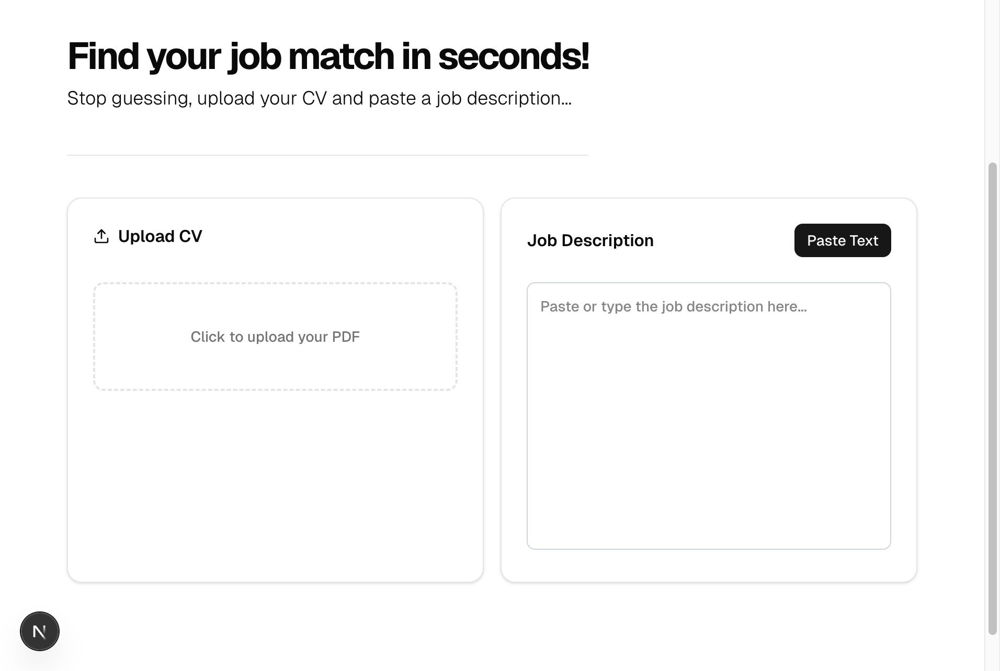
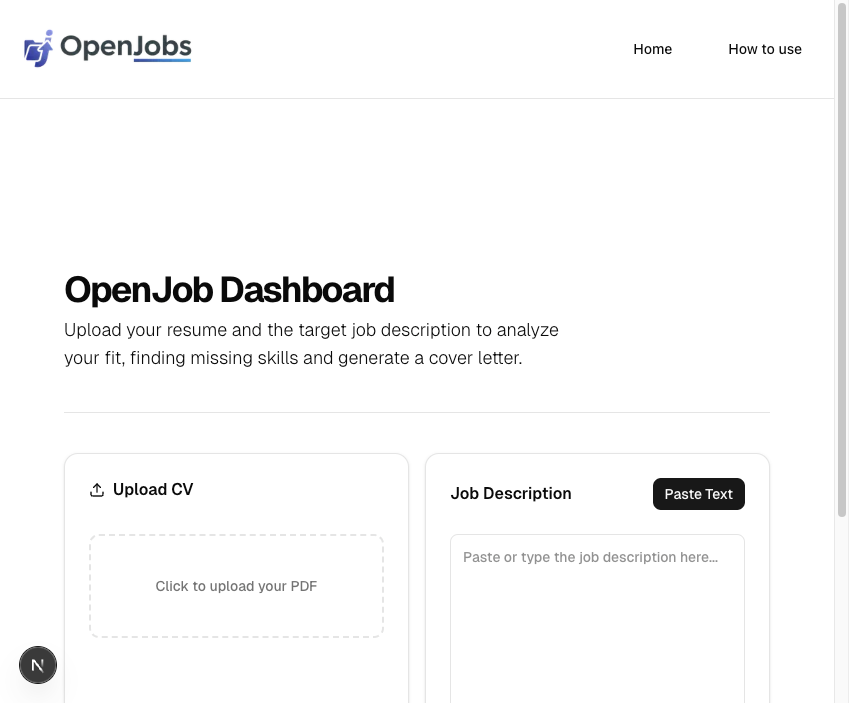
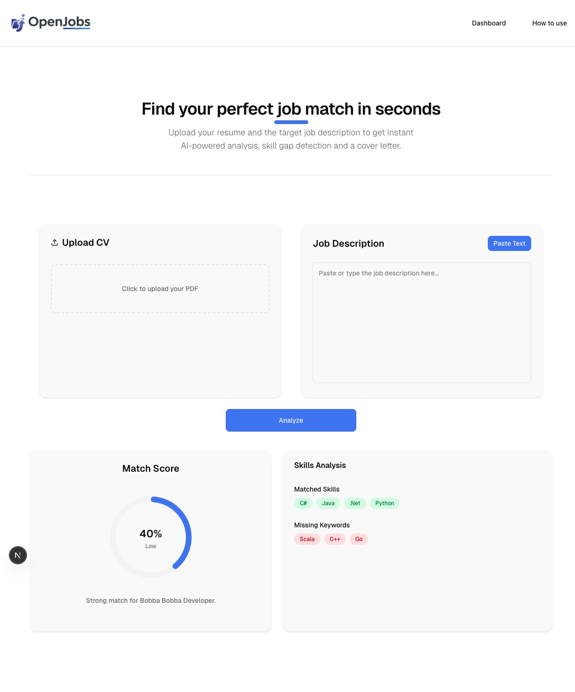
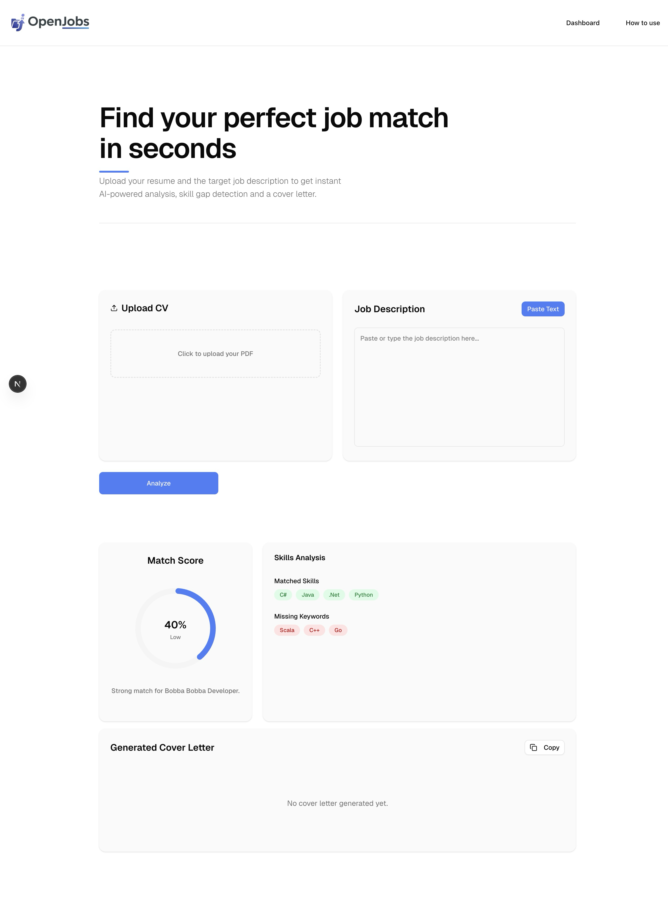
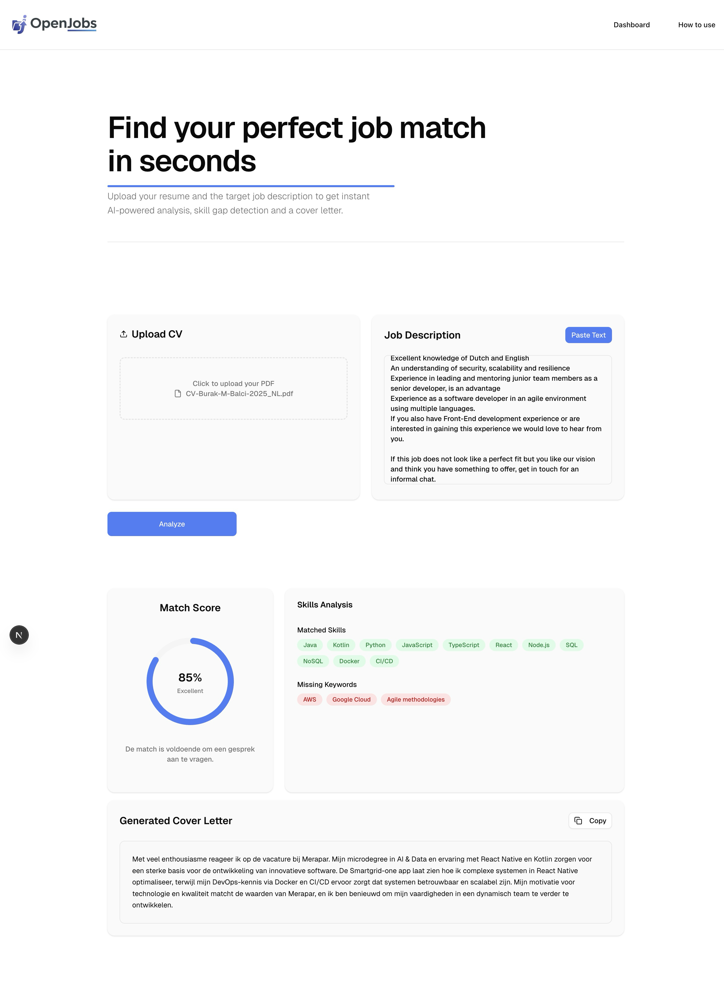
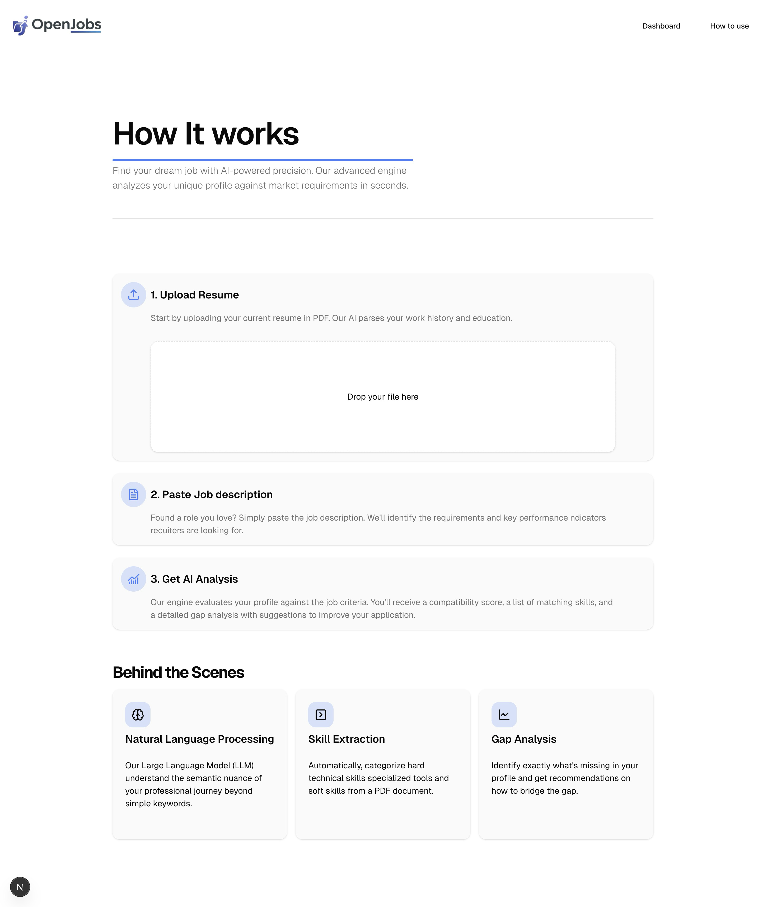

# 🚀 OpenJob - AI-Powered Job Matching Tool

**OpenJob** is een full-stack applicatie die werkzoekenden helpt om hun CV direct te toetsen aan vacatureteksten. Door gebruik te maken van lokale LLM's (Large Language Models), analyseert de tool de match tussen vaardigheden en genereert het een gepersonaliseerde motivatiebrief.

## 🛠 Tech Stack

- **Frontend:** Next.js 16, TypeScript, shadcn/ui, Tailwind CSS.
- **Backend:** FastAPI (Python), PDFPlumber.
- **AI Engine:** Ollama (DeepSeek-R1 / Gemma3), Prompt Engineering.
- **Infrastructure:** Docker (containerization).

## 🧠 Hoe het werkt

1. **PDF Extraction:** De backend gebruikt `pdfplumber` om gestructureerde tekst uit geüploade CV's te halen.
2. **Context Grounding:** De AI krijgt zowel de CV-tekst als de vacaturetekst binnen via een strikt gedefinieerde 'system prompt'.
3. **Reasoning (DeepSeek-R1):** Het model analyseert overlappingen en hiaten in de tech-stack (bijv. herkent dat 'React.js' op het CV matcht met 'React' in de vacature).
4. **Structured Output:** De AI levert een JSON-response die door de frontend wordt vertaald naar een interactief dashboard.

## 📈 Technical Challenges & Reflection (AI & Data Engineering)

Tijdens de ontwikkeling van OpenJob heb ik verschillende uitdagingen aangepakt die direct aansluiten:

- **Hallucinatie Management:** Aanvankelijk verzon de AI skills (zoals Angular) die niet op het CV stonden. Ik heb dit opgelost door *Strict Grounding* in de prompt engineering toe te passen.
- **Local AI Inference:** Gekozen voor Ollama om data-privacy te waarborgen (CV-data verlaat de lokale machine niet) en om kosten te minimaliseren.
- **JSON Parsing:** Het filteren van de json-tags van DeepSeek-R1 om een valide JSON-response te garanderen voor de frontend.

## 🚀 Installatie

1. **Backend:**

   ```bash
   cd oj_backend
   pip install -r requirements.txt
   uvicorn main:app --reload
    ```

2. **Local AI:**

    ```bash
    ollama pull deepseek-r1
    ```

3. **Frontend**

    ```bash
    cd oj_frontend
    npm install
    npm run dev
    ```

## 🛠 Project Evolution

Tijdens de ontwikkeling heb ik het project iteratief verbeterd. Hieronder zie je de belangrijkste stappen in de transformatie van een technisch prototype naar een gepolijste SaaS-oplossing.

### 1️⃣ De Functionele Fundering


In de beginfase lag de focus op de technische 'proof of concept'. Ik implementeerde de eerste integratie tussen de **FastAPI-backend** en de **Next.js-frontend**. De nadruk lag hier op het bouwen van een robuuste parser die ruwe PDF-data via `pdfplumber` accuraat kon omzetten in tekst, klaar voor verwerking door de AI.

### 2️⃣ AI-Integratie & Score-Berekening


De eerste stap naar een intelligent systeem. Hier introduceerde ik de 'Analyze' functionaliteit. De backend stuurt de geparste data naar **DeepSeek-R1**, die op basis van een custom prompt een match-score berekent. De UI werd uitgebreid met de eerste 'Skills Analysis' sectie om de gebruiker direct feedback te geven.

### 3️⃣ Visuele Gap Analysis


UX-verbetering door middel van visualisatie. In plaats van simpele tekst, gebruik ik nu voortgangscirkels en kleurgecodeerde badges (matched vs. missing keywords). Dit maakt het voor de gebruiker in één oogopslag duidelijk waar de sterke punten liggen en waar de 'skill gaps' zich bevinden.

### 4️⃣ Content Generatie & Copy-Flow


Toevoeging van de generatieve laag. Naast analyse kan OpenJob nu ook een gepersonaliseerde motivatiebrief opstellen die de matched skills benadrukt. Ik heb een 'Copy-to-Clipboard' feature toegevoegd om de workflow van de gebruiker te versnellen.

### 5️⃣ UI/UX Polishing & Branding


De transitie naar een volwaardige SaaS-ervaring. Door gebruik te maken van **shadcn/ui** componenten en een verfijnd kleurenpalet (geïnspireerd op de Next.js esthetiek), kreeg het dashboard een professionele uitstraling. De informatie-architectuur werd geoptimaliseerd voor leesbaarheid en visuele rust.

### 6️⃣ User Onboarding & Architectuur



De laatste hand aan de user experience: een interactieve 'How It Works' sectie. Hier leg ik de 'Behind the Scenes' logica uit — van **Natural Language Processing** tot **Gap Analysis**. Dit verhoogt het vertrouwen van de gebruiker door transparant te zijn over hoe AI-beslissingen tot stand komen.

## 📝 Zelfreflectie

...
