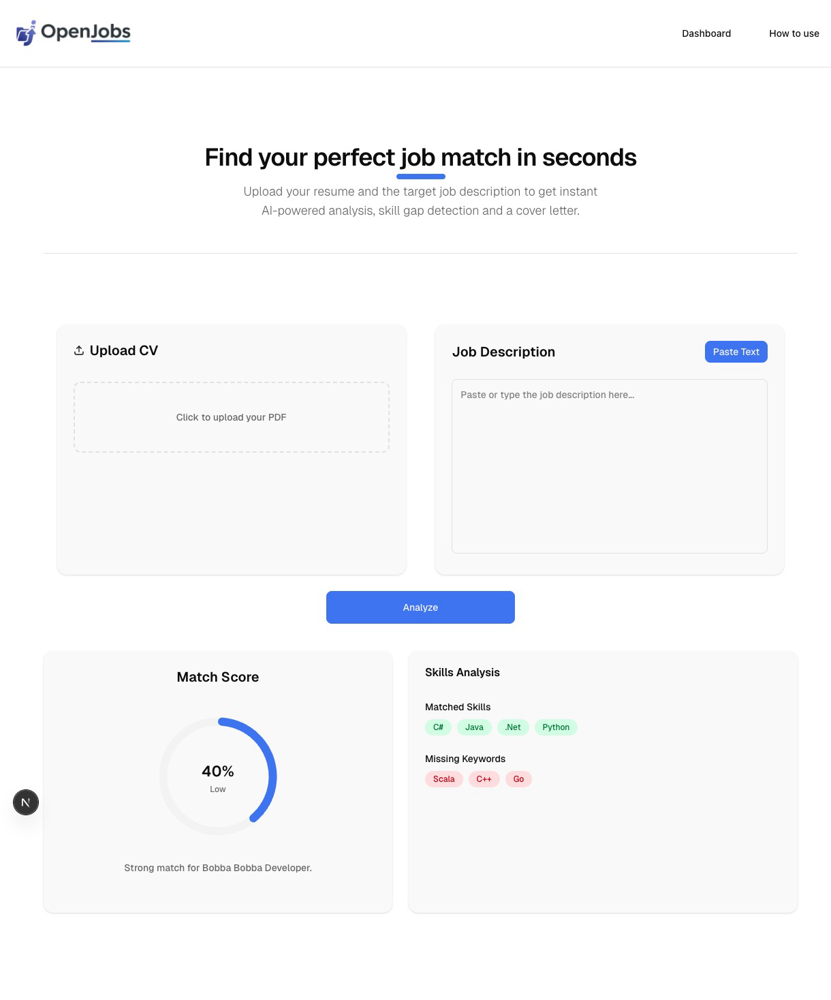
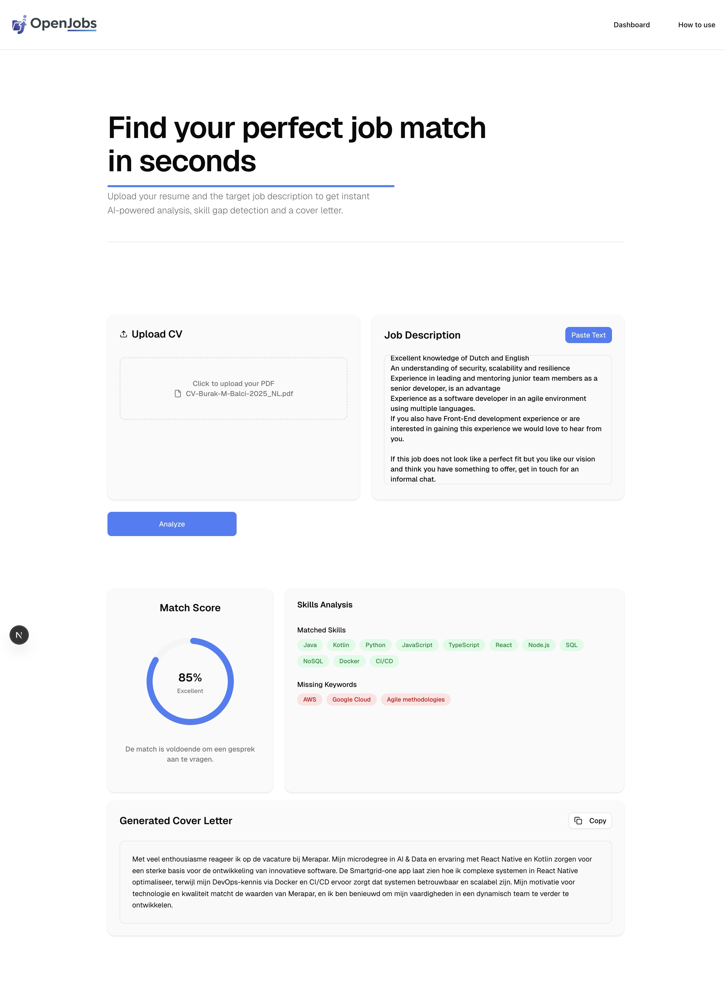

# AI Resume Evaluator: Mijn Eerste AI-Native Project

Al een tijdje ben ik bezig met iets waar ik best trots op ben, dus tijd om het te delen.

Ik bouwde een AI Resume Evaluator, genaamd open-job(s). Het idee is simpel: je uploadt je CV als PDF, plakt een vacaturetekst erin, en het systeem vertelt je hoe goed ze op elkaar aansluiten.

Het extraheert relevante skills en genereert meteen,een motivatiebrief.

Voor het model gebruik ik een versie van Qwen, gefinetuned met Unsloth, wat je daar uit een kleine dataset kan halen is echt indrukwekkend.

De frontend is gebouwd met Next.js, Tailwind en Shadcn/ui. En het volledige development proces heb ik doorlopen met Claude Code, wat me echt geholpen heeft om gefocust te blijven op de architectuur in plaats van te verzanden in details.

Dit project was voor mij vooral een manier om écht te leren werken met de huidige generatie AI-tools — niet door tutorials te volgen, maar door gewoon iets te bouwen. De drempel is lager dan ooit, maar de pipeline goed begrijpen blijft cruciaal.

Nog niet af, maar de kern werkt!

\#AI #SoftwareDevelopment #NextJS #ShadcnUI #Unsloth #ClaudeCode #Ollama #LLM
